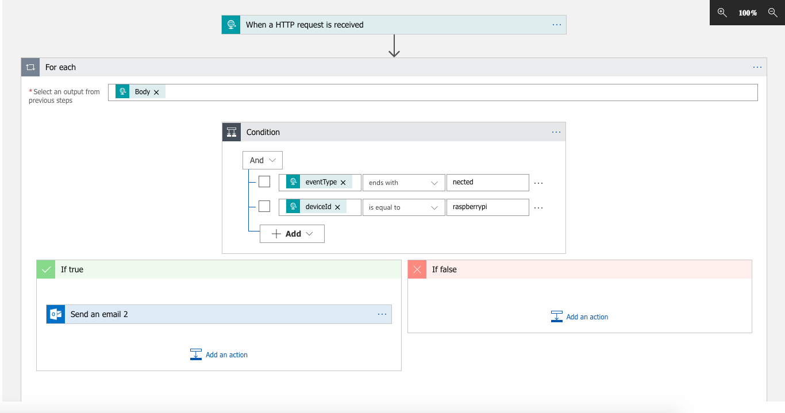
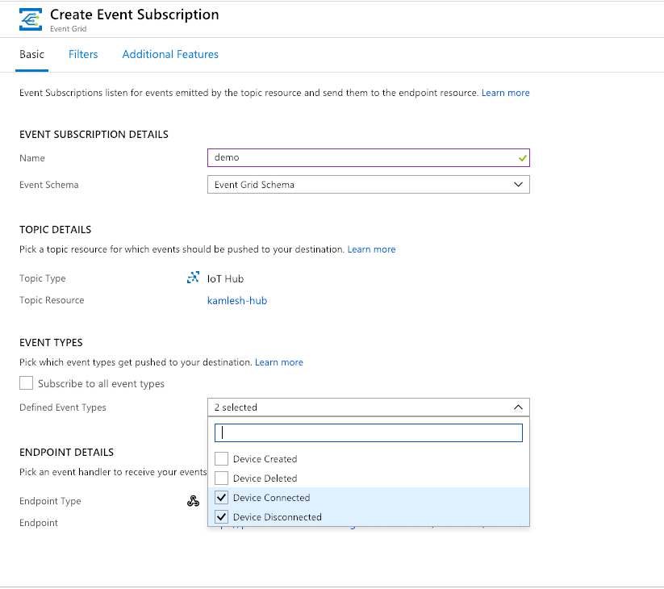
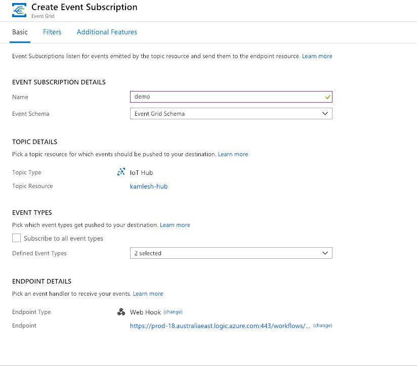
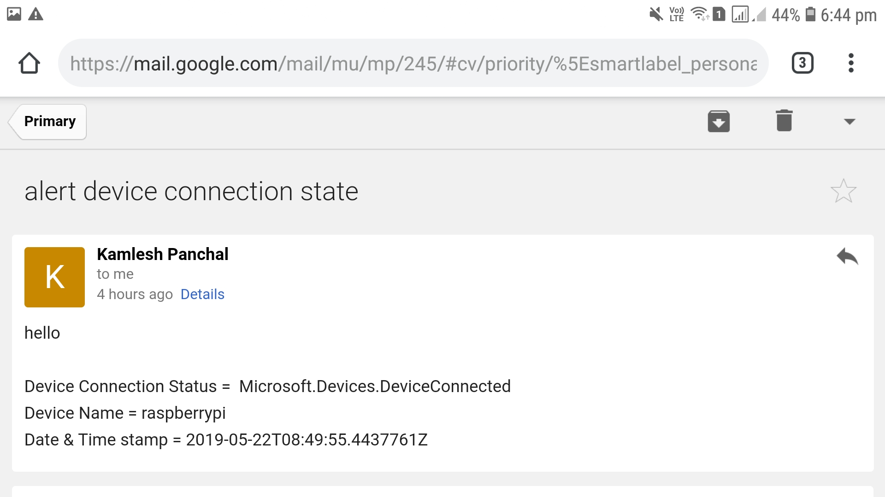
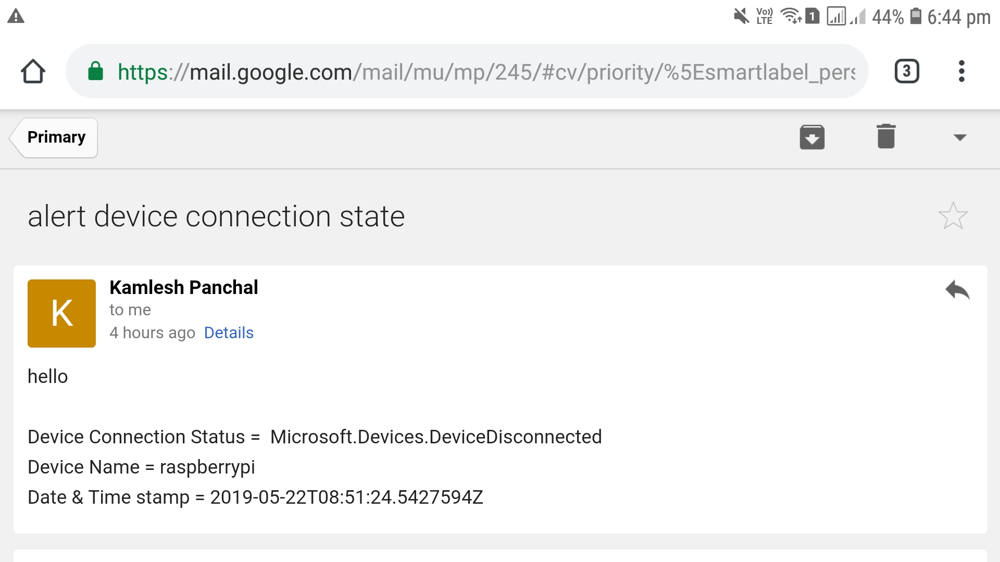

# Azure IOT Event Grid with Logic apps

## What is Azure Event Grid?

Azure Event Grid allows you to easily build applications with event-based architectures. First, select the Azure resource you would like to subscribe to, and then give the event handler or WebHook endpoint to send the event to. Event Grid has built-in support for events coming from Azure services, like storage blobs and resource groups. Event Grid also has support for your own events, using custom topics.

Azure event grid help us build event based application and integrate IOT device events in our solutions.Here explain you one solution built using azure iot event grid and logic apps.If IOT device connection state change connected and disconnected with azure iot hub alert email will be send to predefined email with connection state, device name and date & timestamp.

All trigger events defined in logic app and post url of (when http request is received) logic app block set in event grid subscription with webhook for check device connection states and trigger events.

## Logic app design

## create event grid subscription

### subscribe with only two event types device connected and disconnected 

### Endpoint type is webhook and set url of logic app http request url block for receive events.

## Device connected email alert 

## Device disconnected email alert 

## Reference for setup logic app design and event grid subscription

https://docs.microsoft.com/en-us/azure/iot-hub/iot-hub-how-to-order-connection-state-events
